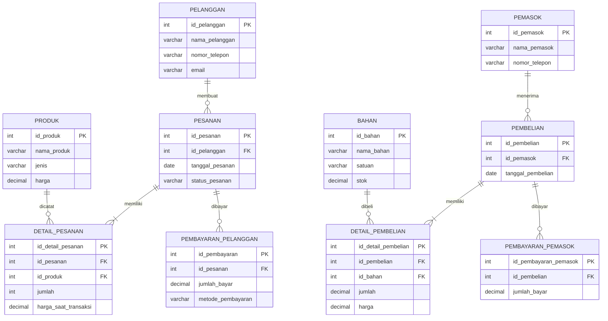

# HALAMAN AWAL

## COVER

# PROJECT SISTEM INFORMASI AKUNTANSI
## Studi Kasus: Sistem Informasi Akuntansi pada Perusahaan Percetakan

**Nama perusahaan:** CV Cetak Maju  
**Nama dan NIM anggota:**

| No. | Nama | NIM |
|---|---|---|
| 1 | [isi nama] | [isi NIM] |
| 2 | [isi nama] | [isi NIM] |
| 3 | [isi nama] | [isi NIM] |
| 4 | [isi nama] | [isi NIM] |

## LEMBAR PERNYATAAN ORISINALITAS

Kami menyatakan bahwa laporan progres Tahap 1 ini disusun secara orisinal
oleh anggota kelompok. Setiap sumber dan bantuan yang digunakan telah
dinyatakan secara jujur dalam laporan. Penggunaan AI hanya sebagai alat bantu
penyusunan dan tetap diverifikasi oleh anggota kelompok.

Tempat, tanggal: [isi]  
Ketua kelompok: [isi nama dan tanda tangan]

## DAFTAR ISI

1. BAB I Pendahuluan  
2. BAB II Metode Pengumpulan Data  
3. BAB III Spesifikasi Kebutuhan (SRS)  
4. BAB IV Perancangan Basis Data  
5. BAB V Progres dan Rencana Tahap 2  
6. Lampiran

> Catatan: data pemilik dan karyawan berikut berasal dari informasi yang
> diberikan pengguna. Bagian bertanda data dummy masih perlu dikonfirmasi.

---

# BAB I PENDAHULUAN

## 1.1 Identitas Perusahaan

- Nama perusahaan: CV Cetak Maju (nama usaha perlu dikonfirmasi)
- Bidang usaha: Percetakan / Offset Printing
- Alamat: Jl. Merdeka No. 25, Kota Bandung (data dummy)
- Tahun berdiri: 2018 (data dummy)
- Skala usaha: Usaha kecil menengah (data dummy)
- Jumlah karyawan: 3 orang
- Pemilik/pimpinan: Evi Indrawati, selaku pemilik dan owner
- Jam operasional: Senin-Sabtu, 08.00-17.00 WIB (data dummy)

## 1.2 Gambaran Umum Perusahaan

CV Cetak Maju merupakan perusahaan yang bergerak di bidang percetakan,
khususnya jasa percetakan offset dan produk cetak lainnya. Perusahaan
melayani pesanan mulai dari penerimaan pesanan, penentuan kebutuhan
produksi, penggunaan bahan baku, proses produksi, hingga penyerahan hasil
cetak kepada pelanggan.

Sebagian proses pencatatan masih dilakukan secara manual sehingga terdapat
kendala dalam pencatatan pelanggan, pesanan, produk, bahan, karyawan, dan
transaksi. Sistem Informasi Akuntansi ini digunakan untuk menganalisis
kebutuhan sistem yang membantu pengelolaan transaksi dan informasi akuntansi.

## 1.3 Struktur Organisasi dan Peran

| Peran | Nama | Tanggung Jawab |
|---|---|---|
| Pemilik/Owner | Evi Indrawati | Mengawasi usaha, menyetujui pembelian, dan memantau laporan |
| Admin | Rina | Menerima pesanan, mencatat pelanggan, transaksi, dan pembayaran |
| Operator mesin cetak | Rukun | Menyiapkan bahan dan menjalankan proses pencetakan |
| Finishing | Atin | Memeriksa, merapikan, dan menyelesaikan hasil cetak |

## 1.4 Tujuan dan Ruang Lingkup SIA

Tujuan sistem adalah memusatkan pencatatan pelanggan, pesanan, produksi,
stok bahan, pembelian, dan pembayaran sehingga informasi lebih mudah dicari
dan laporan dapat dibuat dengan lebih cepat.

Ruang lingkup yang masuk: data pelanggan, produk/jasa, bahan, pemasok,
pesanan, detail pesanan, pembelian bahan, pembayaran pelanggan, pembayaran
pemasok, pembaruan stok, dan laporan transaksi. Ruang lingkup yang belum
masuk: penggajian, perpajakan, akuntansi buku besar, integrasi bank, dan
penjualan melalui marketplace.

---

## 1.5 Kondisi Sistem Saat Ini (As-Is)

## 1.5.1 Penerimaan Pesanan

1. Pelanggan menghubungi atau datang ke perusahaan.
2. Pelanggan menyampaikan kebutuhan cetak.
3. Admin mencatat informasi pesanan.
4. Admin menentukan produk atau jasa yang dipesan.
5. Perusahaan mengecek bahan dan kemampuan produksi.
6. Pesanan diteruskan ke bagian produksi.
7. Produk diproses sampai selesai.
8. Hasil cetak diserahkan kepada pelanggan.
9. Pembayaran dicatat sesuai kondisi transaksi.

Masalah utama: pencatatan pesanan, pelanggan, dan pembayaran masih
menggunakan buku catatan serta spreadsheet sederhana.

### Dokumentasi
- [FOTO 1 - Kegiatan penerimaan/administrasi pesanan]
- [FOTO 2 - Kondisi tempat kerja bagian administrasi]

## 1.5.2 Proses Produksi

1. Bagian produksi menerima informasi pesanan.
2. Bagian produksi mengecek kebutuhan bahan.
3. Bahan disiapkan.
4. Proses produksi dilakukan.
5. Hasil produksi diperiksa.
6. Pesanan yang sesuai diserahkan kepada pelanggan.
7. Jika terdapat masalah, dilakukan perbaikan atau produksi ulang.

### Dokumentasi
- [FOTO 3 - Aktivitas proses produksi]
- [FOTO 4 - Mesin/peralatan percetakan]

## 1.5.3 Pengelolaan Bahan

1. Stok bahan diperiksa.
2. Bahan yang tersedia digunakan untuk produksi.
3. Jika tidak mencukupi, dilakukan pembelian.
4. Bahan yang diterima dicatat.
5. Bahan disimpan dan digunakan sesuai kebutuhan.

Pembaruan stok belum selalu dilakukan segera setelah bahan digunakan atau
diterima dari pemasok.

### Dokumentasi
- [FOTO 5 - Gudang/tempat penyimpanan bahan]
- [FOTO 6 - Contoh bahan baku percetakan]

---

## 1.6 Transaksi / Siklus SIA

## 1.6.1 Siklus Pendapatan (Revenue Cycle)

Pelanggan -> Pesanan -> Penjualan -> Piutang (jika ada) -> Pembayaran ->
Penerimaan kas.

Data yang dicatat meliputi pelanggan, pesanan, detail pesanan, harga, jumlah,
total transaksi, status pembayaran, metode pembayaran, dan tanggal pembayaran.

## 1.6.2 Siklus Pengeluaran (Expenditure Cycle)

Kebutuhan bahan -> Pembelian bahan -> Penerimaan bahan -> Utang (jika kredit)
-> Pembayaran kepada pemasok.

Data yang dicatat meliputi pemasok, bahan, pembelian, detail pembelian,
jumlah, harga, total pembelian, status pembayaran, dan tanggal pembayaran.

---

## 1.7 Masalah Sistem Saat Ini

## 1.7.1 Pencatatan Masih Manual

Pencatatan dilakukan melalui buku dan spreadsheet dengan format yang belum
seragam, sehingga admin perlu memeriksa beberapa sumber.

Dampak: risiko kesalahan, data sulit dicari, dan waktu pencatatan lebih lama.

## 1.7.2 Pemantauan Status Pesanan

Status pesanan dikonfirmasi melalui komunikasi langsung antara admin dan
produksi. Belum tersedia daftar status terpusat.

Dampak: posisi pesanan sulit diketahui dan risiko keterlambatan meningkat.

## 1.7.3 Pengelolaan Bahan Baku

Stok kertas, tinta, dan bahan pendukung dicatat secara berkala, tetapi tidak
selalu diperbarui saat bahan digunakan atau diterima.

Dampak: risiko kekurangan atau kelebihan stok dan gangguan produksi.

## 1.7.4 Pencatatan Transaksi dan Pembayaran

Nota dan bukti pembayaran disimpan secara terpisah. Rekap transaksi dibuat
secara manual pada akhir periode.

Dampak: rekap membutuhkan waktu dan riwayat pembayaran sulit ditelusuri.

---

# BAB II METODE PENGUMPULAN DATA

## 2.1 Observasi

Aspek yang diamati:

- [x] Penerimaan pesanan
- [x] Pencatatan pelanggan
- [x] Pencatatan transaksi
- [x] Proses produksi
- [x] Penggunaan bahan
- [x] Pengadaan bahan
- [x] Penerimaan bahan
- [x] Pembayaran
- [x] Penyimpanan dokumen
- [x] Pelaporan

### Dokumentasi Observasi
- [FOTO 7 - Kegiatan observasi]
- [FOTO 8 - Aktivitas karyawan]
- [FOTO 9 - Proses administrasi]

## 2.2 Wawancara

Informan:
- Nama: Rina
- Jabatan: Admin
- Tanggal: [isi tanggal wawancara]
- Lokasi: [isi lokasi wawancara]

### Daftar Pertanyaan

| No. | Pertanyaan | Jenis | Informasi yang Dicari |
|---|---|---|---|
| 1 | Bisa diceritakan alur pesanan sejak pelanggan menghubungi sampai hasil cetak diserahkan? | Terbuka | Alur siklus pendapatan |
| 2 | Data apa saja yang dicatat ketika pesanan diterima? | Terbuka | Elemen data pesanan |
| 3 | Apakah setiap pesanan memiliki nomor atau kode transaksi? | Tertutup | Identitas unik pesanan |
| 4 | Jika terjadi perubahan spesifikasi, bagaimana proses pencatatannya? | Probing | Kendali perubahan pesanan |
| 5 | Bagaimana pembayaran pelanggan dicatat dan diverifikasi? | Terbuka | Proses penerimaan kas |
| 6 | Bagaimana Rukun menerima informasi pekerjaan dari admin? | Terbuka | Serah terima ke produksi |
| 7 | Bagaimana Atin mengetahui pekerjaan yang harus diselesaikan? | Terbuka | Proses finishing |
| 8 | Kapan stok bahan diperbarui setelah bahan digunakan? | Tertutup | Ketepatan informasi persediaan |
| 9 | Dokumen apa yang digunakan untuk pembelian bahan dari pemasok? | Terbuka | Dokumen siklus pengeluaran |
| 10 | Apakah laporan pesanan, pembayaran, dan stok sudah memenuhi kebutuhan Evi Indrawati? | Konfirmasi | Validasi kebutuhan owner |

### Hasil Wawancara

Pelanggan menyampaikan kebutuhan melalui WhatsApp atau datang langsung. Admin
mencatat spesifikasi, menghitung estimasi harga, dan meneruskan detail kepada
produksi. Pembayaran dilakukan melalui transfer atau tunai. Stok diperiksa
sebelum produksi dan bahan dibeli jika persediaan tidak cukup. Pemilik
membutuhkan laporan pesanan, penjualan, pembayaran, pembelian, dan stok.

## 2.3 Dokumen yang Diamati

Nota, invoice, bukti pembayaran, catatan pesanan, catatan pembelian, catatan
stok, dokumen produksi, data pelanggan, dan data pemasok.

---

## 2.4 Dokumentasi Lapangan

### Foto 1
**Kegiatan:** Penerimaan pesanan pelanggan (data dummy)  
**Lokasi:** Ruang administrasi (data dummy)  
**Tanggal:** 15 September 2026 (data dummy)  
**Keterangan:** Admin mencatat detail pesanan.  
[MASUKKAN FOTO]

### Foto 2
**Kegiatan:** Proses produksi (data dummy)  
**Lokasi:** Area produksi (data dummy)  
**Tanggal:** 16 September 2026 (data dummy)  
**Keterangan:** Operator menyiapkan bahan dan menjalankan mesin.  
[MASUKKAN FOTO]

### Foto 3
**Kegiatan:** Pemeriksaan bahan baku (data dummy)  
**Lokasi:** Gudang bahan (data dummy)  
**Tanggal:** 16 September 2026 (data dummy)  
**Keterangan:** Admin memeriksa jumlah kertas dan tinta.  
[MASUKKAN FOTO]

---

# BAB III SPESIFIKASI KEBUTUHAN (SRS)

## 3.1 Data yang Diperlukan Sistem

### 3.1.1 Data Master

#### Pelanggan
- id_pelanggan, nama_pelanggan, alamat, nomor_telepon, email

#### Produk/Jasa
- id_produk, nama_produk, jenis, ukuran, harga

#### Bahan
- id_bahan, nama_bahan, satuan, stok

#### Karyawan
- id_karyawan, nama, jabatan, gaji

### Pemasok
- id_pemasok, nama_pemasok, alamat, nomor_telepon

### 3.1.2 Data Transaksi

#### Pesanan
- id_pesanan, id_pelanggan, tanggal_pesanan, status_pesanan

#### Detail Pesanan
- id_detail_pesanan, id_pesanan, id_produk, jumlah, harga, subtotal

#### Pembayaran Pelanggan
- id_pembayaran, id_pesanan, tanggal_pembayaran, jumlah_bayar, metode_pembayaran

#### Pembelian Bahan
- id_pembelian, id_pemasok, tanggal_pembelian, status_pembelian

#### Detail Pembelian
- id_detail_pembelian, id_pembelian, id_bahan, jumlah, harga, subtotal

#### Pembayaran Pemasok
- id_pembayaran_pemasok, id_pembelian, jumlah_bayar, metode_pembayaran

---

## 3.2 Rancangan Entitas SIA

Pelanggan, Pesanan, Detail_Pesanan, Produk, Bahan, Karyawan, Pemasok,
Pembayaran_Pelanggan, Pembelian, Detail_Pembelian, dan Pembayaran_Pemasok.

## 3.3 Hubungan Antar Entitas

- Pelanggan 1:N Pesanan
- Pesanan 1:N Detail_Pesanan
- Produk 1:N Detail_Pesanan
- Pesanan 1:N Pembayaran_Pelanggan
- Pemasok 1:N Pembelian
- Pembelian 1:N Detail_Pembelian
- Bahan 1:N Detail_Pembelian
- Pembelian 1:N Pembayaran_Pemasok

## 3.4 Kebutuhan Fungsional

- **FR-01:** Sistem dapat menyimpan data pelanggan.
- **FR-02:** Sistem dapat mencatat pesanan dan detail pesanan.
- **FR-03:** Sistem dapat mencatat pembayaran pelanggan.
- **FR-04:** Sistem dapat mencatat data bahan.
- **FR-05:** Sistem dapat mencatat pembelian bahan.
- **FR-06:** Sistem dapat mencatat pembayaran kepada pemasok.
- **FR-07:** Sistem dapat memperbarui stok bahan.
- **FR-08:** Sistem dapat menghasilkan laporan transaksi.

## 3.5 Kebutuhan Non-Fungsional

- **NFR-01 Security:** Login berdasarkan hak akses pengguna.
- **NFR-02 Performance:** Data transaksi ditampilkan dalam waktu wajar.
- **NFR-03 Usability:** Antarmuka mudah digunakan admin dan perusahaan.
- **NFR-04 Data Integrity:** Data wajib harus lengkap sebelum disimpan.
- **NFR-05 Audit Trail:** Perubahan transaksi penting dapat ditelusuri.

## 3.6 User Stories

- **US-01:** Sebagai admin, saya ingin mencatat pelanggan agar datanya dapat digunakan kembali.
- **US-02:** Sebagai admin, saya ingin mencatat pesanan agar transaksi terdokumentasi.
- **US-03:** Sebagai admin, saya ingin mencatat pembayaran agar status pembayaran diketahui.
- **US-04:** Sebagai bagian pembelian, saya ingin mencatat pembelian bahan.
- **US-05:** Sebagai pemilik, saya ingin melihat laporan transaksi.

## 3.7 MoSCoW Prioritization

| ID | Requirement | Prioritas |
|---|---|---|
| FR-01 | Data pelanggan | Must |
| FR-02 | Pesanan | Must |
| FR-03 | Pembayaran pelanggan | Must |
| FR-04 | Data bahan | Must |
| FR-05 | Pembelian bahan | Must |
| FR-06 | Pembayaran pemasok | Must |
| FR-07 | Stok bahan | Must |
| FR-08 | Laporan | Should |

# BAB IV PERANCANGAN BASIS DATA

## 4.1 Normalisasi

### Tabel Awal

Contoh data belum ternormalisasi: satu baris memuat pelanggan, pesanan,
beberapa produk, bahan, dan pembayaran sekaligus.

### 1NF

Setiap kolom berisi satu nilai dan setiap detail produk dibuat sebagai baris
terpisah pada tabel Detail_Pesanan.

### 2NF

Data pelanggan dan produk dipisahkan dari detail pesanan agar tidak bergantung
sebagian pada kunci gabungan.

### 3NF

Data pemasok, bahan, pembayaran, dan pesanan dipisahkan sehingga tidak ada
ketergantungan transitif.

## 4.2 Database Design

```sql
CREATE TABLE pelanggan (
    id_pelanggan INT PRIMARY KEY,
    nama_pelanggan VARCHAR(100) NOT NULL,
    alamat TEXT,
    nomor_telepon VARCHAR(20),
    email VARCHAR(100)
);
```

---

## 4.3 Data Dictionary Awal

| Tabel | Field | Tipe Data | Key | Keterangan |
|---|---|---|---|---|
| pelanggan | id_pelanggan | INT | PK | ID pelanggan |
| pelanggan | nama_pelanggan | VARCHAR(100) | - | Nama pelanggan |
| pesanan | id_pesanan | INT | PK | ID pesanan |
| pesanan | id_pelanggan | INT | FK | Relasi ke pelanggan |
| pesanan | tanggal_pesanan | DATE | - | Tanggal pesanan |
| pesanan | status_pesanan | VARCHAR(30) | - | Status pesanan |
| pembayaran_pelanggan | id_pembayaran | INT | PK | ID pembayaran |
| pembayaran_pelanggan | id_pesanan | INT | FK | Relasi ke pesanan |

Data dictionary ini masih berupa contoh awal dan akan dilengkapi setelah ERD
final disepakati.

## 3.8 Traceability Matrix

| Requirement | Sumber | Entitas/Tabel |
|---|---|---|
| FR-01 | Wawancara admin (dummy) | Pelanggan |
| FR-02 | Observasi pesanan (dummy) | Pesanan, Detail_Pesanan |
| FR-03 | Wawancara admin (dummy) | Pembayaran_Pelanggan |
| FR-04 | Observasi gudang (dummy) | Bahan |
| FR-05 | Observasi pengadaan (dummy) | Pembelian, Detail_Pembelian |
| FR-06 | Wawancara pemilik (dummy) | Pembayaran_Pemasok |

## 2.5 Triangulasi

**Observasi:** Pencatatan pesanan dan stok masih dilakukan secara manual.  
**Wawancara:** Admin membutuhkan pencatatan terpusat dan laporan berkala.  
**Dokumen:** Nota dan catatan stok menjadi bukti utama transaksi (dummy).  
**Kesimpulan:** Ketiga sumber menunjukkan kebutuhan sistem terintegrasi.

**Prosedur tertulis:** Setiap pesanan dan perubahan stok dicatat pada dokumen.  
**Praktik sebenarnya:** Sebagian informasi disampaikan melalui chat dan direkap kemudian.  
**Perbedaan:** Pencatatan aktual tidak selalu dilakukan saat transaksi.  
**Dampak:** Informasi dapat terlambat dan tidak sinkron.

## 2.6 Dokumentasi Pendukung

Daftar bukti dummy: foto kegiatan KP, foto administrasi, foto produksi, foto
mesin, foto bahan, foto dokumen transaksi, foto nota/invoice, foto lingkungan
perusahaan, hasil wawancara, dan hasil observasi.

Foto atau dokumen yang mengandung data sensitif akan disensor sebelum dimasukkan
ke laporan.

## 4.4 Pemetaan Struktur Laporan

- **BAB I - Profil dan Analisis Masalah:** profil, struktur, proses bisnis, siklus, masalah, tujuan, dan ruang lingkup.
- **BAB II - Pengumpulan Data:** metode, wawancara, observasi, studi dokumen, hasil, dan triangulasi.
- **BAB III - SRS:** functional requirements, non-functional requirements, MoSCoW, user stories, traceability, konflik, dan verifikasi.
- **BAB IV - Perancangan Basis Data:** kebutuhan data, ERD, relasi, skema, normalisasi, DDL, sample data, dan data dictionary.
- **BAB V - Progres dan Rencana Tahap 2:** progres, kontribusi, pengembangan, pembagian tugas, teknologi, dan refleksi.
- **LAMPIRAN:** dokumentasi foto, bukti wawancara, dokumen, DDL SQL, pengujian, log progres, kontribusi, dan deklarasi penggunaan AI.

---

## 3.9 Lampiran Pemenuhan Format UTS

## Lampiran A - Lembar Observasi

**Proses yang diamati:** Penerimaan dan penyelesaian pesanan cetak  
**Lokasi:** [isi lokasi]  
**Tanggal/Jam:** [isi tanggal dan jam]  
**Pengamat:** [isi nama anggota]

| No. | Aspek yang Diamati | Ya | Tidak | Catatan |
|---|---|---|---|---|
| 1 | Pesanan pelanggan dicatat oleh admin | Ya | - | Dicatat oleh Rina |
| 2 | Spesifikasi produk dicatat lengkap | Ya | - | Ukuran, jenis, dan jumlah dicatat |
| 3 | Pesanan diberi nomor transaksi | Belum dikonfirmasi | - | Perlu verifikasi lapangan |
| 4 | Admin meneruskan pesanan kepada operator | Ya | - | Disampaikan kepada Rukun |
| 5 | Bahan diperiksa sebelum produksi | Ya | - | Kertas dan tinta diperiksa |
| 6 | Operator mencatat penggunaan bahan | Belum dikonfirmasi | - | Perlu bukti dokumen |
| 7 | Hasil cetak diperiksa sebelum finishing | Ya | - | Diperiksa sebelum diserahkan kepada Atin |
| 8 | Bagian finishing memeriksa hasil akhir | Ya | - | Dilakukan oleh Atin |
| 9 | Pembayaran pelanggan dicatat | Ya | - | Dicatat oleh admin |
| 10 | Laporan transaksi dibuat untuk owner | Belum dikonfirmasi | - | Validasi kepada Evi Indrawati |

## Lampiran B - Daftar Dokumen dan Informasi yang Diperoleh

| Dokumen | Informasi yang Diperoleh | Elemen Data |
|---|---|---|
| Nota/invoice | Identitas pesanan dan nilai transaksi | id_pesanan, tanggal, total |
| Bukti pembayaran | Jumlah, tanggal, dan metode pembayaran | id_pembayaran, jumlah_bayar, metode |
| Catatan pesanan | Spesifikasi dan status pekerjaan | pelanggan, produk, jumlah, status |
| Catatan stok | Bahan masuk, bahan keluar, dan saldo | id_bahan, satuan, stok |
| Catatan pembelian | Pemasok dan pembelian bahan | id_pemasok, tanggal, total |

## Lampiran C - Triangulasi dan Verifikasi Kebutuhan

**Temuan konsisten:** Observasi menunjukkan pesanan dan stok dicatat oleh admin;
wawancara Rina menjelaskan proses yang sama; nota dan catatan stok menjadi
dokumen pendukung. Temuan ini menghasilkan kebutuhan FR-02, FR-04, dan FR-07.

**Kesenjangan:** Prosedur ideal mengharuskan stok diperbarui setiap terjadi
penggunaan bahan, tetapi praktiknya pembaruan dapat dilakukan secara berkala.
Kesenjangan ini menghasilkan kebutuhan validasi dan riwayat perubahan stok.

**Verifikasi:** Draf kebutuhan dikonfirmasi kepada Rina sebagai admin dan Evi
Indrawati sebagai owner. Revisi yang dilakukan adalah menambahkan laporan stok,
status pesanan, dan hak akses owner. Tanggal konfirmasi: [isi tanggal].

## Lampiran D - Kebutuhan Fungsional dan Non-Fungsional Terukur

| ID | Deskripsi | Jenis | MoSCoW | Sumber |
|---|---|---|---|---|
| FR-01 | Sistem menyimpan data pelanggan | Fungsional | Must | Wawancara Rina |
| FR-02 | Sistem mencatat pesanan dan detail produk | Fungsional | Must | Observasi |
| FR-03 | Sistem mencatat pembayaran pelanggan | Fungsional | Must | Nota dan wawancara |
| FR-04 | Sistem menyimpan data bahan dan stok | Fungsional | Must | Catatan stok |
| FR-05 | Sistem mencatat pembelian bahan | Fungsional | Must | Wawancara |
| FR-06 | Sistem mencatat pembayaran pemasok | Fungsional | Must | Wawancara owner |
| FR-07 | Sistem memperbarui stok setelah transaksi | Fungsional | Must | Observasi |
| FR-08 | Sistem menghasilkan laporan transaksi | Fungsional | Should | Wawancara owner |
| NFR-01 | Hanya admin dan owner yang dapat login sesuai hak akses | Non-fungsional | Must | Wawancara owner |
| NFR-02 | Halaman daftar pesanan tampil maksimal 3 detik untuk 10.000 data | Non-fungsional | Should | Analisis sistem |
| NFR-03 | Field wajib harus tervalidasi sebelum transaksi disimpan | Non-fungsional | Must | Integritas data |
| NFR-04 | Sistem tersedia minimal 99% selama jam kerja | Non-fungsional | Should | Kebutuhan operasional |
| NFR-05 | Setiap perubahan stok menyimpan pengguna dan waktu perubahan | Non-fungsional | Must | Audit trail |

Alasan prioritas Must: kebutuhan tersebut langsung mendukung pencatatan
pendapatan, pengeluaran, stok, pengendalian akses, dan integritas transaksi.

## Lampiran E - User Story dan Konflik Kebutuhan

| ID | User Story | Kebutuhan |
|---|---|---|
| US-01 | Sebagai admin, saya ingin mencatat pelanggan agar data pelanggan dapat digunakan kembali. | FR-01 |
| US-02 | Sebagai admin, saya ingin mencatat pesanan agar pekerjaan dapat dipantau. | FR-02 |
| US-03 | Sebagai admin, saya ingin mencatat pembayaran agar status pelunasan diketahui. | FR-03 |
| US-04 | Sebagai operator, saya ingin melihat detail pekerjaan agar produksi sesuai pesanan. | FR-02 |
| US-05 | Sebagai owner, saya ingin melihat laporan agar dapat mengambil keputusan. | FR-08 |

**Konflik kebutuhan:** Rina membutuhkan proses input yang cepat, sedangkan Evi
Indrawati membutuhkan validasi dan audit trail yang lengkap. Penyelesaiannya
adalah menggunakan field wajib dan pilihan dropdown agar input tetap cepat,
serta mencatat pengguna dan waktu setiap perubahan tanpa menghambat transaksi.

## Lampiran F - Pemetaan Kebutuhan Data ke Dokumen Sumber

| Dokumen Sumber | Field Dokumen | Elemen Data Sistem | Kebutuhan |
|---|---|---|---|
| Nota/invoice | Nomor, tanggal, pelanggan, total | id_pesanan, tanggal_pesanan, id_pelanggan, total | FR-02, FR-08 |
| Bukti pembayaran | Nomor pesanan, jumlah, metode | id_pembayaran, id_pesanan, jumlah_bayar, metode_pembayaran | FR-03 |
| Catatan stok | Nama bahan, jumlah masuk/keluar | id_bahan, stok, satuan | FR-04, FR-07 |
| Catatan pembelian | Pemasok, bahan, jumlah, harga | id_pembelian, id_pemasok, id_bahan, subtotal | FR-05 |

---

## 4.6 ERD dan Skema Relasional



`DETAIL_PESANAN` dan `DETAIL_PEMBELIAN` merupakan associative entity untuk
menyelesaikan relasi many-to-many. `subtotal` adalah atribut derived dari
`jumlah * harga_saat_transaksi`.

### 4.6.1 Skema Relasional

- PELANGGAN(**id_pelanggan**, nama_pelanggan, alamat, nomor_telepon, email)
- PRODUK(**id_produk**, nama_produk, jenis, ukuran, harga)
- BAHAN(**id_bahan**, nama_bahan, satuan, stok)
- PEMASOK(**id_pemasok**, nama_pemasok, alamat, nomor_telepon)
- PESANAN(**id_pesanan**, *id_pelanggan*, tanggal_pesanan, status_pesanan)
- DETAIL_PESANAN(**id_detail_pesanan**, *id_pesanan*, *id_produk*, jumlah, harga_saat_transaksi)
- PEMBAYARAN_PELANGGAN(**id_pembayaran**, *id_pesanan*, tanggal_pembayaran, jumlah_bayar, metode_pembayaran)
- PEMBELIAN(**id_pembelian**, *id_pemasok*, tanggal_pembelian, status_pembelian)
- DETAIL_PEMBELIAN(**id_detail_pembelian**, *id_pembelian*, *id_bahan*, jumlah, harga)
- PEMBAYARAN_PEMASOK(**id_pembayaran_pemasok**, *id_pembelian*, jumlah_bayar, metode_pembayaran)

---

## 4.7 DDL dan Pengujian Database

```sql
CREATE TABLE pelanggan (
    id_pelanggan INT PRIMARY KEY,
    nama_pelanggan VARCHAR(100) NOT NULL,
    alamat VARCHAR(200), nomor_telepon VARCHAR(20), email VARCHAR(100) UNIQUE
);
CREATE TABLE produk (
    id_produk INT PRIMARY KEY, nama_produk VARCHAR(100) NOT NULL,
    jenis VARCHAR(50) NOT NULL, ukuran VARCHAR(30), harga DECIMAL(15,2) NOT NULL CHECK (harga > 0)
);
CREATE TABLE bahan (
    id_bahan INT PRIMARY KEY, nama_bahan VARCHAR(100) NOT NULL,
    satuan VARCHAR(20) NOT NULL, stok DECIMAL(15,2) NOT NULL CHECK (stok >= 0)
);
CREATE TABLE pemasok (
    id_pemasok INT PRIMARY KEY, nama_pemasok VARCHAR(100) NOT NULL,
    alamat VARCHAR(200), nomor_telepon VARCHAR(20)
);
CREATE TABLE pesanan (
    id_pesanan INT PRIMARY KEY, id_pelanggan INT NOT NULL,
    tanggal_pesanan DATE NOT NULL, status_pesanan VARCHAR(30) NOT NULL,
    FOREIGN KEY (id_pelanggan) REFERENCES pelanggan(id_pelanggan)
);
CREATE TABLE detail_pesanan (
    id_detail_pesanan INT PRIMARY KEY, id_pesanan INT NOT NULL, id_produk INT NOT NULL,
    jumlah INT NOT NULL CHECK (jumlah > 0), harga_saat_transaksi DECIMAL(15,2) NOT NULL CHECK (harga_saat_transaksi > 0),
    UNIQUE (id_pesanan, id_produk),
    FOREIGN KEY (id_pesanan) REFERENCES pesanan(id_pesanan), FOREIGN KEY (id_produk) REFERENCES produk(id_produk)
);
CREATE TABLE pembayaran_pelanggan (
    id_pembayaran INT PRIMARY KEY, id_pesanan INT NOT NULL, tanggal_pembayaran DATE NOT NULL,
    jumlah_bayar DECIMAL(15,2) NOT NULL CHECK (jumlah_bayar > 0), metode_pembayaran VARCHAR(20) NOT NULL,
    FOREIGN KEY (id_pesanan) REFERENCES pesanan(id_pesanan)
);
CREATE TABLE pembelian (
    id_pembelian INT PRIMARY KEY, id_pemasok INT NOT NULL, tanggal_pembelian DATE NOT NULL,
    status_pembelian VARCHAR(30) NOT NULL, FOREIGN KEY (id_pemasok) REFERENCES pemasok(id_pemasok)
);
CREATE TABLE detail_pembelian (
    id_detail_pembelian INT PRIMARY KEY, id_pembelian INT NOT NULL, id_bahan INT NOT NULL,
    jumlah DECIMAL(15,2) NOT NULL CHECK (jumlah > 0), harga DECIMAL(15,2) NOT NULL CHECK (harga > 0),
    UNIQUE (id_pembelian, id_bahan), FOREIGN KEY (id_pembelian) REFERENCES pembelian(id_pembelian),
    FOREIGN KEY (id_bahan) REFERENCES bahan(id_bahan)
);
CREATE TABLE pembayaran_pemasok (
    id_pembayaran_pemasok INT PRIMARY KEY, id_pembelian INT NOT NULL,
    jumlah_bayar DECIMAL(15,2) NOT NULL CHECK (jumlah_bayar > 0), metode_pembayaran VARCHAR(20) NOT NULL,
    FOREIGN KEY (id_pembelian) REFERENCES pembelian(id_pembelian)
);
```

## 4.7.1 Contoh INSERT dan Pengujian Constraint

```sql
INSERT INTO pelanggan VALUES
(1,'Andi','Bandung','081200000001','andi@example.com'),
(2,'Sari','Bandung','081200000002','sari@example.com'),
(3,'Deni','Cimahi','081200000003','deni@example.com'),
(4,'Maya','Garut','081200000004','maya@example.com'),
(5,'Tono','Bandung','081200000005','tono@example.com');
INSERT INTO produk VALUES
(1,'Brosur A4','Brosur','A4',1500),(2,'Kartu Nama','Kartu','9x5 cm',500),
(3,'Poster','Poster','A3',5000),(4,'Banner','Banner','1x2 m',75000),(5,'Undangan','Undangan','A5',2500);
INSERT INTO bahan VALUES
(1,'Kertas Art Paper','lembar',1000),(2,'Tinta Hitam','ml',500),
(3,'Tinta Warna','ml',700),(4,'Plastik Laminasi','lembar',400),(5,'Karton','lembar',300);
INSERT INTO pemasok VALUES
(1,'PT Kertas Jaya','Bandung','022700001'),(2,'CV Tinta Abadi','Bandung','022700002'),
(3,'UD Plastik Makmur','Cimahi','022700003'),(4,'CV Karton Sejahtera','Garut','022700004'),(5,'PT Bahan Cetak','Bandung','022700005');
INSERT INTO pesanan VALUES
(1,1,'2026-09-01','Selesai'),(2,2,'2026-09-02','Diproses'),
(3,3,'2026-09-03','Selesai'),(4,4,'2026-09-04','Menunggu'),(5,5,'2026-09-05','Selesai');
INSERT INTO detail_pesanan VALUES
(1,1,1,100,1500),(2,2,2,200,500),(3,3,3,20,5000),(4,4,4,2,75000),(5,5,5,100,2500);
INSERT INTO pembayaran_pelanggan VALUES
(1,1,'2026-09-01',150000,'Transfer'),(2,2,'2026-09-02',100000,'Tunai'),
(3,3,'2026-09-03',100000,'Transfer'),(4,4,'2026-09-04',150000,'Transfer'),(5,5,'2026-09-05',250000,'Tunai');
INSERT INTO pembelian VALUES
(1,1,'2026-08-25','Lunas'),(2,2,'2026-08-26','Lunas'),(3,3,'2026-08-27','Kredit'),
(4,4,'2026-08-28','Lunas'),(5,5,'2026-08-29','Kredit');
INSERT INTO detail_pembelian VALUES
(1,1,1,500,1000),(2,2,2,200,25000),(3,3,3,300,30000),(4,4,4,100,1500),(5,5,5,100,2000);
INSERT INTO pembayaran_pemasok VALUES
(1,1,500000,'Transfer'),(2,2,5000000,'Transfer'),(3,3,9000000,'Transfer'),
(4,4,150000,'Tunai'),(5,5,200000,'Transfer');

-- Contoh ditolak: stok tidak boleh bernilai negatif.
INSERT INTO bahan VALUES (6,'Bahan Salah','lembar',-1);
```

## 4.7.2 Normalisasi dan Anomali

Tabel awal menyimpan pelanggan, pesanan, produk, dan pembayaran dalam satu
baris sehingga terdapat pengulangan data. Pada 1NF, setiap detail produk
dipisahkan menjadi baris atomik. Pada 2NF, data pelanggan dan produk dipisah
dari detail dengan ketergantungan penuh pada kunci. Pada 3NF, data pemasok,
bahan, pembayaran, dan pesanan dipisah untuk menghilangkan ketergantungan
transitif. Pemisahan ini mencegah insertion, update, dan delete anomaly.

---

## 4.8 Data Dictionary Lengkap

| Tabel | Primary Key | Foreign Key | Field Utama |
|---|---|---|---|
| pelanggan | id_pelanggan | - | nama, alamat, telepon, email |
| produk | id_produk | - | nama, jenis, ukuran, harga |
| bahan | id_bahan | - | nama, satuan, stok |
| pemasok | id_pemasok | - | nama, alamat, telepon |
| pesanan | id_pesanan | id_pelanggan | tanggal, status |
| detail_pesanan | id_detail_pesanan | id_pesanan, id_produk | jumlah, harga_saat_transaksi |
| pembayaran_pelanggan | id_pembayaran | id_pesanan | tanggal, jumlah, metode |
| pembelian | id_pembelian | id_pemasok | tanggal, status |
| detail_pembelian | id_detail_pembelian | id_pembelian, id_bahan | jumlah, harga |
| pembayaran_pemasok | id_pembayaran_pemasok | id_pembelian | jumlah, metode |

---

# BAB V PROGRES DAN RENCANA TAHAP 2

| Pertemuan | Kegiatan | Penanggung Jawab | Luaran |
|---|---|---|---|
| P1 | Menentukan kasus dan kebutuhan data | [nama anggota] | Profil kasus |
| P2 | Menentukan entitas dan relasi | [nama anggota] | ERD versi 1 |
| P3 | Menyempurnakan ERD | [nama anggota] | ERD final |
| P4 | Menyusun skema relasional | [nama anggota] | Skema relasional |
| P5 | Normalisasi dan DDL | [nama anggota] | File SQL |
| P6 | Menyusun SRS dan MoSCoW | [nama anggota] | Daftar kebutuhan |
| P7 | Wawancara, observasi, triangulasi | [nama anggota] | Bukti pengumpulan data |
| P8 | Finalisasi laporan UTS | [nama anggota] | Laporan Tahap 1 |

| Pertemuan | Rencana Tahap 2 | Luaran |
|---|---|---|
| P9 | DFD level 0 dan level 1 | Diagram DFD |
| P10 | Use case, class, dan sequence diagram | Diagram UML |
| P11-P12 | Query laporan dan manipulasi SQL | File query SQL |
| P13-P14 | Implementasi antarmuka dan pengujian | Prototipe SIA |
| P15 | Penyempurnaan dan presentasi | Demo final |

Rencana teknologi: HTML/CSS/JavaScript atau framework yang disepakati
kelompok, DBMS MySQL/MariaDB, dan draw.io atau Mermaid untuk pemodelan.

## 5.1 Log Progres

## 5.2 Rencana UAS / Tahap 2

## 5.3 Lembar Kontribusi Anggota

| No. | Nama | NIM | Peran | Kontribusi | Tanda Tangan |
|---|---|---|---|---:|---|
| 1 | [isi nama] | [isi NIM] | Analisis kebutuhan | [isi]% | [isi] |
| 2 | [isi nama] | [isi NIM] | Perancangan database | [isi]% | [isi] |
| 3 | [isi nama] | [isi NIM] | Dokumentasi dan pengujian | [isi]% | [isi] |
| 4 | [isi nama] | [isi NIM] | Penyusunan laporan | [isi]% | [isi] |
|  |  |  | **Total** | **100%** |  |

## 5.4 Refleksi Kelompok

Kendala utama Tahap 1 adalah data proses bisnis dan dokumen transaksi belum
seluruhnya tersedia dalam format terstruktur. Kelompok mengatasinya dengan
membandingkan hasil wawancara, observasi, dan dokumen, kemudian menandai data
yang masih perlu dikonfirmasi. Pada tahap berikutnya, kelompok akan memvalidasi
ERD dan DDL kepada owner sebelum mengembangkan prototipe.

## 5.5 Pernyataan Penggunaan AI

# LAMPIRAN

Lampiran A sampai G berisi notulen dan bukti wawancara/observasi, dokumen
sumber, file `.sql`, lembar kontribusi anggota, serta pernyataan penggunaan AI
yang dirujuk pada bagian-bagian terkait di atas.

AI digunakan sebagai alat bantu penyusunan struktur dokumen, perapian bahasa,
dan pembuatan contoh data dummy. Validasi data perusahaan, wawancara,
observasi, keputusan kebutuhan, serta pemeriksaan akhir tetap menjadi tanggung
jawab anggota kelompok.
